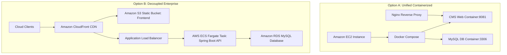

# AWS Production Deployment Guide

This guide details the step-by-step procedures to deploy the Cloud Management System (CMS) to Amazon Web Services (AWS) under two production-grade topologies.

---

## Architecture Topologies



---

## Option A: Unified Containerized Deployment on EC2

*Ideal for rapid staging environments or cost-sensitive production.*

### Step 1: Provision the EC2 Instance
1. Open the **AWS Console** and navigate to **EC2**.
2. Click **Launch Instance**:
   - **AMI**: Ubuntu Server 22.04 LTS (HVM).
   - **Instance Type**: `t3.small` (2 vCPU, 2 GB RAM) or larger.
   - **Key Pair**: Create or choose an existing key pair.
   - **Security Group**: Configure inbound firewall rules:
     - `22 (SSH)`: Restrict access to your IP address.
     - `80 (HTTP)`: Open to anywhere (`0.0.0.0/0`).
     - `443 (HTTPS)`: Open to anywhere (`0.0.0.0/0`).
3. Click **Launch** and note the public IP address.

### Step 2: Install Docker and Compose on EC2
Connect to your instance via SSH:
```bash
ssh -i /path/to/key.pem ubuntu@your-ec2-ip
```

Update system resources and install Docker:
```bash
sudo apt-get update
sudo apt-get install -y docker.io docker-compose
sudo systemctl enable docker
sudo systemctl start docker
sudo usermod -aG docker ubuntu
```
*Note: Log out and log back in to apply the group permissions.*

### Step 3: Run the Application
1. Transfer the application source files to the EC2 instance (e.g. using `git clone` or `scp`).
2. Run Docker Compose in detached mode:
   ```bash
   docker-compose up -d --build
   ```
3. Verify that both containers are running:
   ```bash
   docker ps
   ```

### Step 4: Configure Nginx Reverse Proxy with SSL (HTTPS)
1. Install Nginx:
   ```bash
   sudo apt-get install -y nginx
   ```
2. Create an Nginx configuration block (`/etc/nginx/sites-available/cms`):
   ```nginx
   server {
       listen 80;
       server_name yourdomain.com www.yourdomain.com;

       location / {
           proxy_pass http://localhost:8081;
           proxy_set_header Host $host;
           proxy_set_header X-Real-IP $remote_addr;
           proxy_set_header X-Forwarded-For $proxy_add_x_forwarded_for;
           proxy_set_header X-Forwarded-Proto $scheme;
       }
   }
   ```
3. Enable configuration and restart Nginx:
   ```bash
   sudo ln -s /etc/nginx/sites-available/cms /etc/nginx/sites-enabled/
   sudo systemctl restart nginx
   ```
4. Obtain free SSL Certificates via **Certbot (Let's Encrypt)**:
   ```bash
   sudo apt-get install -y certbot python3-certbot-nginx
   sudo certbot --nginx -d yourdomain.com -d www.yourdomain.com
   ```

---

## Option B: Decoupled Enterprise Deployment

*Best practice for scaling, security, and zero-downtime maintenance.*

### Step 1: Deploy Frontend UI to Amazon S3
1. Open the **Amazon S3** console and click **Create bucket**:
   - Set a globally unique name (e.g. `cms-frontend-production`).
   - Disable **Block all public access** (Access will be routed exclusively through CloudFront).
2. Upload the contents of the root `frontend/` folder (`index.html`, `styles.css`, `app.js`) directly to the bucket root.

### Step 2: Set up Database using Amazon RDS (MySQL)
1. Navigate to **RDS** and click **Create database**:
   - **Engine Type**: MySQL.
   - **Templates**: Dev/Test (or Production for replica support).
   - **Credentials**: Set master username (e.g. `cms_user`) and a secure password.
   - **Connectivity**: Place RDS inside your VPC. Ensure **Public access** is set to **No**.
2. Note the database **Endpoint Endpoint URL** (e.g., `cms-db.c123456.us-east-1.rds.amazonaws.com`).

### Step 3: Host Backend on AWS ECS (Elastic Container Service)
1. **Push Image to ECR (Elastic Container Registry)**:
   - Create a private repository in ECR named `cms-backend`.
   - Run the ECR login commands locally to authenticate, compile, and push your docker image:
     ```bash
     aws ecr get-login-password --region us-east-1 | docker login --username AWS --password-stdin your-account-id.dkr.ecr.us-east-1.amazonaws.com
     docker build -t cms-backend .
     docker tag cms-backend:latest your-account-id.dkr.ecr.us-east-1.amazonaws.com/cms-backend:latest
     docker push your-account-id.dkr.ecr.us-east-1.amazonaws.com/cms-backend:latest
     ```
2. **Launch ECS Fargate Task**:
   - Create a Task Definition utilizing **Fargate** (Serverless container runtime).
   - Specify the ECR image URI.
   - Define **Environment Variables** mapping connection properties:
     - `DB_URL`: `jdbc:mysql://your-rds-endpoint:3306/cms_cloud?useSSL=false`
     - `DB_USERNAME`: `cms_user`
     - `DB_PASSWORD`: `your-rds-password`
     - `DB_DRIVER`: `com.mysql.cj.jdbc.Driver`
     - `DB_DIALECT`: `org.hibernate.dialect.MySQLDialect`
     - `DB_DDL`: `update`
   - Run the task inside an **ECS Service** mapped behind an **Application Load Balancer (ALB)**.

### Step 4: Route Traffic via CloudFront (CDN)
1. Open the **CloudFront** console and click **Create distribution**:
   - **Origin Domain**: Select your S3 bucket.
   - **Origin Access Control (OAC)**: Enable OAC to restrict S3 reads exclusively to CloudFront.
2. Add a **Second Origin** (API Routing):
   - **Origin Domain**: Enter the domain DNS name of your **Application Load Balancer (ALB)**.
3. Configure **Behaviors**:
   - **Default Behavior (`/*`)**: Points to S3 Origin (delivers HTML/CSS/JS).
   - **API Behavior (`/api/*`)**: Points to ALB Origin (forwards JSON API queries to ECS). Set cache parameters to **Disable caching** (ensures live database updates).
4. Configure SSL certificates via **AWS Certificate Manager (ACM)** for custom domain mapping.
