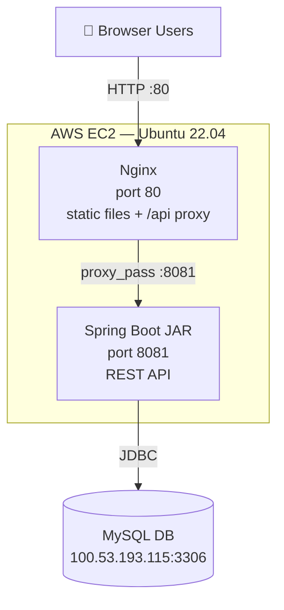

# CMS Deployment Guide — Option A: No Docker

Deploy the **Spring Boot Backend** and **Nginx Frontend** as separate services on a single AWS EC2 instance. No Docker required.

---

## Architecture

```
Internet
   │
   ▼
AWS EC2 Instance (Ubuntu 22.04)
├── Nginx (port 80)  ←── serves index.html / styles.css / app.js
│     └── /api/* ──────── proxied to localhost:8081
└── Spring Boot JAR (port 8081) ←── connects to MySQL
       │
       ▼
External MySQL DB @ 100.53.193.115:3306/CMS_cloud
```

---

## Prerequisites

| Item | Requirement |
|------|-------------|
| AWS Account | Free Tier or paid |
| EC2 Instance | Ubuntu 22.04 LTS, `t3.small` or larger |
| Security Group | Ports 22, 80, 8081 open inbound |
| MySQL | Already running at `100.53.193.115:3306` |

---

## Step 1: Launch AWS EC2 Instance

1. Go to **AWS Console → EC2 → Launch Instance**
2. Choose:
   - **AMI**: Ubuntu Server 22.04 LTS (Free Tier eligible)
   - **Instance type**: `t3.small` (2 vCPU, 2 GB RAM) — ~$15/month
   - **Key pair**: Create new → download `.pem` file (keep it safe!)
3. Under **Network settings → Security Group**, add inbound rules:
   | Port | Protocol | Source | Purpose |
   |------|----------|--------|---------|
   | 22 | TCP | Your IP | SSH access |
   | 80 | TCP | 0.0.0.0/0 | Frontend (Nginx) |
   | 8081 | TCP | 0.0.0.0/0 | Backend API |
4. Click **Launch Instance** and note the **Public IPv4 address**

---

## Step 2: Connect to EC2 via SSH

On your local machine (or Git Bash / PowerShell):

```bash
# Fix key permissions (Linux/Mac)
chmod 400 your-key.pem

# Connect to EC2
ssh -i your-key.pem ubuntu@<YOUR_EC2_PUBLIC_IP>
```

> **Windows users**: Use [PuTTY](https://www.putty.org/) or Windows Terminal with SSH.

---

## Step 3: Upload Project to EC2

**Method A — Git (Recommended if code is on GitHub):**
```bash
# On EC2 terminal
sudo apt-get install -y git
git clone https://github.com/your-username/your-repo.git
cd your-repo
```

**Method B — SCP (Upload from local machine):**
```bash
# On your LOCAL machine — upload the entire project folder
scp -i your-key.pem -r "D:/CBMS/CMS/CMS" ubuntu@<YOUR_EC2_IP>:/home/ubuntu/cms
```

---

## Step 4: Run the Automated Deploy Script

Once the code is on EC2:

```bash
# Navigate to project root
cd /home/ubuntu/cms    # or wherever you uploaded it

# Make deploy script executable
chmod +x deploy.sh

# Run the full deployment
./deploy.sh
```

The script automatically:
- ✅ Installs **Java 17** + **Nginx**
- ✅ Builds the Spring Boot **JAR** with Maven
- ✅ Deploys JAR to `/opt/cms/app.jar`
- ✅ Registers backend as a **systemd service** (auto-starts on reboot)
- ✅ Copies frontend files to `/var/www/cms/`
- ✅ Configures Nginx to serve frontend + proxy API
- ✅ Verifies both services are healthy

---

## Step 5: Verify Deployment

After the script completes, test these URLs in your browser:

| URL | Expected Result |
|-----|----------------|
| `http://<EC2_IP>/` | CMS Login page loads |
| `http://<EC2_IP>/api/health` | `{"status":"UP"}` JSON response |
| Login → Dashboard | Data loads from MySQL DB |

---

## Useful Management Commands

```bash
# ── Backend Service ──────────────────────────────
sudo systemctl status cms-backend       # Check if running
sudo systemctl restart cms-backend      # Restart backend
sudo systemctl stop cms-backend         # Stop backend
sudo journalctl -u cms-backend -f       # Live log stream
sudo journalctl -u cms-backend -n 100   # Last 100 log lines

# ── Nginx (Frontend) ─────────────────────────────
sudo systemctl status nginx             # Check Nginx status
sudo systemctl restart nginx            # Restart Nginx
sudo nginx -t                           # Test config syntax
sudo tail -f /var/log/nginx/error.log   # Nginx error logs

# ── Update Backend (after code change) ──────────
cd /home/ubuntu/cms
git pull                                # Get latest code
./mvnw clean package -DskipTests       # Rebuild JAR
sudo cp target/cloud-management-system-1.0.0.jar /opt/cms/app.jar
sudo systemctl restart cms-backend

# ── Update Frontend (after file change) ─────────
sudo cp frontend/index.html /var/www/cms/
sudo cp frontend/styles.css /var/www/cms/
sudo cp frontend/app.js     /var/www/cms/
```

---

## Troubleshooting

### Backend not starting?
```bash
sudo journalctl -u cms-backend -n 50
# Look for: "Started CMS" or DB connection errors
```

### Can't connect to MySQL?
```bash
# Test DB reachability from EC2
curl -v telnet://100.53.193.115:3306
# If blocked, check your MySQL server firewall / security group
```

### Nginx 502 Bad Gateway?
```bash
# Backend isn't running yet — check status
sudo systemctl status cms-backend
# Spring Boot takes ~30 seconds to start
```

### CORS errors in browser console?
- Already fixed in `SecurityConfig.java` — make sure you rebuilt the JAR after the fix

---

## Option B: Docker Compose (Alternative)

If you later want to use Docker:

```bash
# Install Docker on EC2
sudo apt-get install -y docker.io docker-compose
sudo usermod -aG docker ubuntu
# Log out and back in, then:
docker-compose up -d --build
```

The existing `docker-compose.yml` handles both backend and frontend containers.

---

## AWS Architecture Diagram


